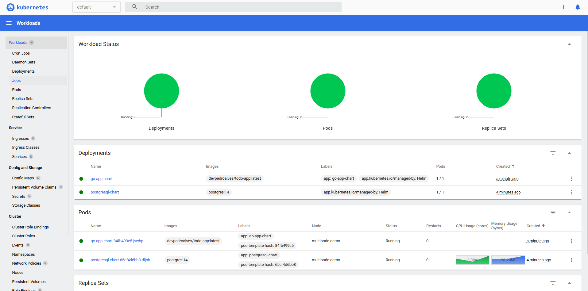

# Todo App in Go

A task management application (Todo List) developed in Go, using the Gin Framework, PostgreSQL and Kubernetes.




## 🚀 Technologies

- [Go](https://golang.org/)
- [Gin Framework](https://github.com/gin-gonic/gin)
- [PostgreSQL](https://www.postgresql.org/)
- [Helm](https://helm.sh/)
- [Kubernetes](https://kubernetes.io/)

## 📋 Prerequisites

- Go 1.16 or higher
- PostgreSQL
- Docker (for local development)
- Kubernetes (for deployment)
- Helm (for managing Kubernetes applications)

## 🔧 Installation

1. Clone the repository

    ```bash
    git clone https://github.com/PedroTeixeiraa/todo-go.git
    ```

2. Navigate to the project directory

    ```bash
    cd todo-go
    ```

3. Install dependencies

    ```bash
    go mod download
    ```

4. Configure the environment variables

   Create a `.env` file or set environment variables for the database connection:

    ```bash
    DB_USER=admin
    DB_PASSWORD=admin
    DB_NAME=tododb
    DB_HOST=localhost
    DB_PORT=5432
    ```

5. Run the command to create the database

    ```bash
    docker compose up -d
    ```

6. Start the application

    ```bash
    go run main.go
    ```

The server will be running at `http://localhost:8080`

## 🛠️ API Endpoints

### Tasks

- `GET /tasks` - List all tasks
- `POST /tasks` - Create a new task
- `GET /tasks/:id` - Get a specific task
- `PUT /tasks/:id` - Update a task
- `DELETE /tasks/:id` - Delete a task

### Task Format

```json
{
  "title": "Example task",
  "description": "Task description",
  "completed": false
}
```

## 🚀 Deploying to Kubernetes

### 🗂️ Folder Structure for Helm Charts

The Helm chart for this project is located under `charts`.

```text
charts/go-app-chart
├── Chart.yaml
├── values.yaml
├── templates/
│   ├── deployment.yaml
│   ├── service.yaml
│   ├── configmap.yaml
│   └── secrets.yaml

```

### 🚀 Steps to Deploy

1. **Ensure your Kubernetes context is set correctly:**

    ```bash
    kubectl config current-context
    ```

2. **Package and deploy the Helm chart:**

    ```bash
    helm upgrade --install todo-app charts/todo-app --namespace default
    ```

3. **Verify the resources were created:**

    ```bash
    kubectl get pods,svc
    ```

4. **Check the application logs:**

    ```bash
    kubectl logs -l app=todo-app
    ```

5. **Access the application:**

   If using a NodePort or LoadBalancer service, access it via the external IP or port:

    ```bash
    http://<node-ip>:<node-port>
    ```

## 📝 License

This project is licensed under the MIT License. See the [LICENSE](LICENSE) file for more details.

## ✒️ Author

* **Pedro Teixeira** - [PedroTeixeiraa](https://github.com/PedroTeixeiraa)

---

⌨️ with ❤️ by [Pedro Teixeira](https://github.com/PedroTeixeiraa) 😊